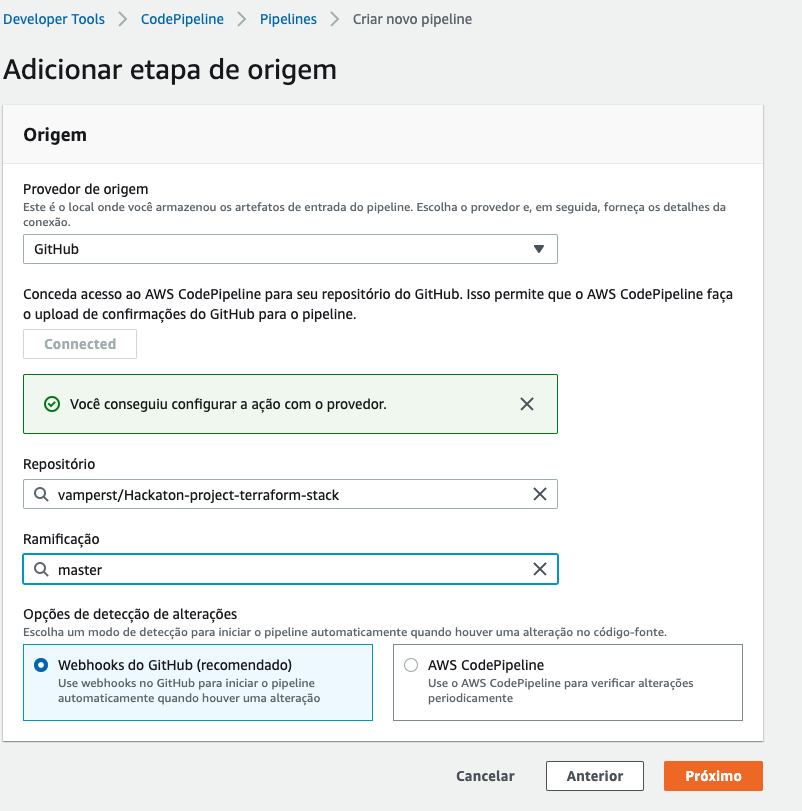
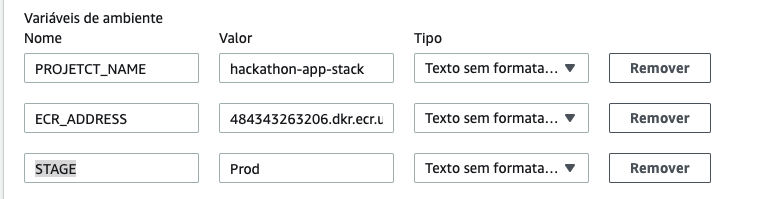
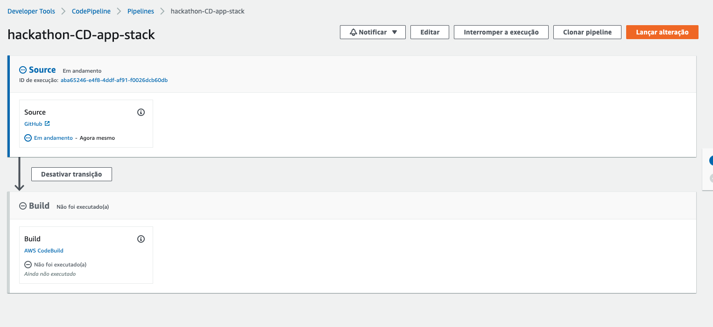
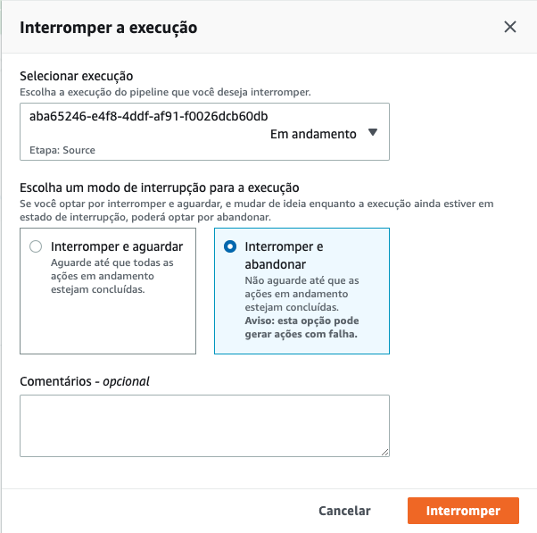
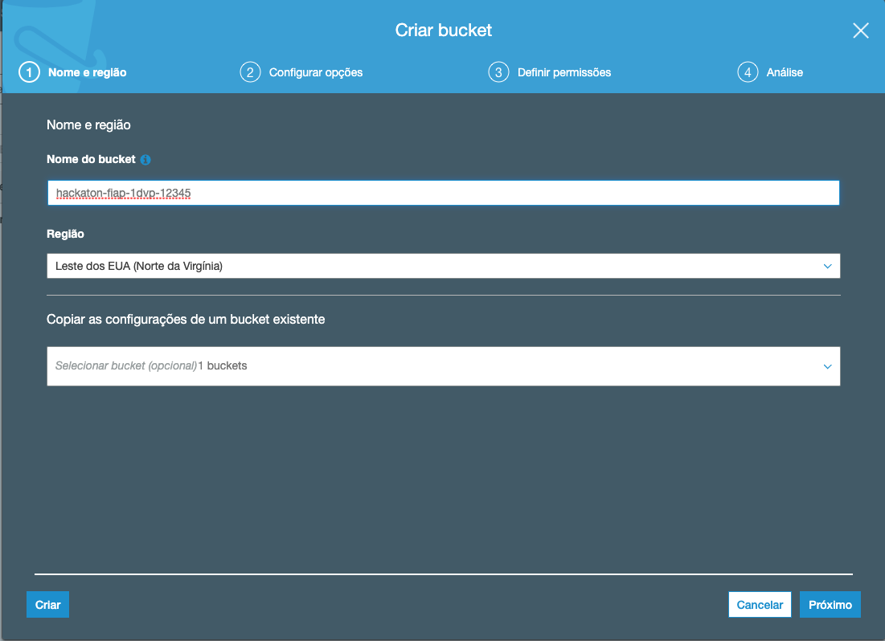
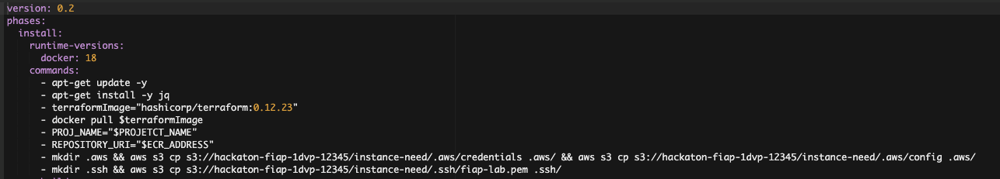
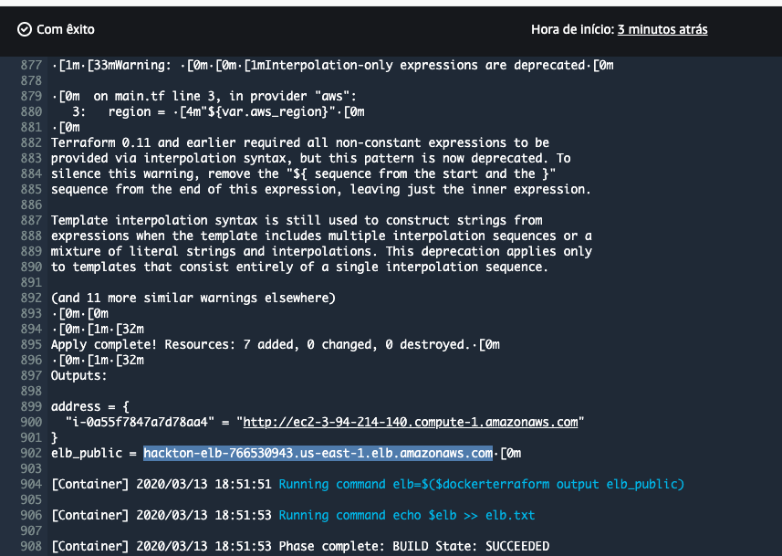
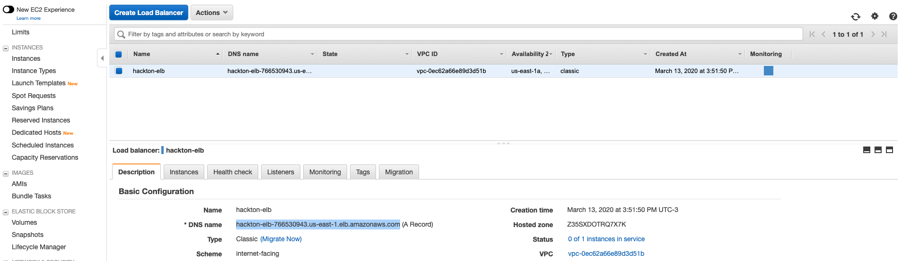
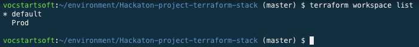
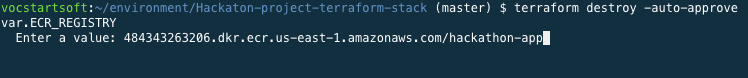

1. Vá para o console do CodePipeline e `Criar novo pipeline`
2. De o nome de 'hackathon-CD-app-stack' e clique em próximo
3. Em origem escolha GitHub e escolha o repositório `cicd-project-terraform-stack` da sua conta.
4. Clique em `Próximo`
   
5. Crie um COdeBuild Identico em configuração ao criado para a fase de CI (não esqueça do módulo privilegiado)e utlize o nome `cicd-app-stack`. Adicione mais uma variavel de ambiente STAGE=prod alem das PROJECT_NAME e ECR_ADDRESS. Clique em próximo.
   
6. Na tela implantação clique em 'Ignorar etapa implantação' e confirme.
7. Clique em 'Criar Pipeline'
8.  Assim que voltar a tela do pipeline criado rapidamente clieque em `Interromper a execução`
    
9.  Na tela que abrir deixe as opções como na imagem e clique em interromper:
    
10. Fizemos isso por 2 motivos:
    1.  Precisamos criar um Bucket onde colocaremos o que é necessário para o código executar com sucesso e alterar o arquivo Buildspec do seu repositório.
    2.  Ainda não alteramos o IAM para ter acesso de administrador como no tutorial 01
11. Vamos primeiro criar o Bucket. No console da AWS vá para serviço S3. Clique em `Criar Bucket`
12. No nome do bucket crie um bucket com o seguinte padrão `cicd-fiap-<sua turma em minusculo>-<numero do seu rm>`, ex: cicd-fiap-28ati-12345. Clique em criar no canto esquerdo inferior.
    
13. No IDE do cloud9 utilize o terminal para atualizar suas credenciais da aws como o setup e configuração descreve para fazer a cada 3 horas de uso.
14. Rode o comando `aws configure` e aperte enter 3 vezes até a opção `Default output format` e digite `json`. Esse processo irá criar o arquivo ~/.aws/config necessário nos próximos passos.
15. No terminal execute os comandos substituindo o bucket pelo o que acabou de criar:
    ```
    aws s3 cp ~/.aws/config s3://cicd-fiap-<sua turma em minusculo>-<numero do seu rm>/instance-need/.aws/config
    aws s3 cp ~/.aws/credentials s3://cicd-fiap-<sua turma em minusculo>-<numero do seu rm>/instance-need/.aws/credentials
    aws s3 cp ~/.ssh/fiap-lab.pem s3://cicd-fiap-<sua turma em minusculo>-<numero do seu rm>/instance-need/.ssh/fiap-lab.pem
    ```
16. No IDE navegue até o arquivo `cicd-project-terraform-stack/buildspec.yml` e abra.
17. Altere todos os s3:// do arquivo para colocar o nome do bucket criado por você.
    
18. Agora vá até o arquivo `cicd-project-terraform-stack/state.tf` e tambem altere o nome do bucket.
19. No console do IAM em funções, busque pela função `codebuild-cicd-app-stack-service-role` e anexe a politica de administrador como feito na função do codepipeline criado no tutorial 1.
20. Faça o commit das alterações no repositório 'cicd-project-terraform-stack'.
    ```
        cd ~/environment/cicd-project-terraform-stack
        git add -A
        git commit -m "atualizando buckets"
        git push origin master
    ```
21. O passao anterior vai executar o pipeline
22. Você pode verificar a execução do pipeline e do codebuild pelo painel do CodePipeline e detalhes.
23. É sempre bom lebrar que a stack precisa dos modulos de VPC e RT dos exercicios de terraform para funcionar.
24. Ao final da execução você consegue pegar o link do ELB criado no final do log do codebuild ou no painel ec2/elastic clod balancers. Não esqueça que demora alguns minutos para a instancia se registrar no ELB:
    
    
25. Para performar o destroy volte ao terminal do Cloud9
26. Entre na pasta do projeto de terraform `cd ~/environment/cicd-project-terraform-stack/`
27. Verifique se o bucket do arquivo state.tf esta com o valor correto do nome que você criou.
28. Execute o comando `terraform init` no terminal
29. Execute o comando `terraform workspace list` para ver que agora temos um workpace criado pelo pipeline chamado 'Prod'
    
30. Execute o comando `terraform workspace select Prod` para mudar para a workspace desejada.
31. Execute o comando `terraform destroy -auto-approve` e ao perguntar o endereço od registry cole a URL do ECR criado.
    
32. Faça quantos testes achar necessário. Você pode alterar o count do main para subir mais EC2 no ELB. Lembre-se sempre de commitar as alterações no seu repositório. Não no do professor. 